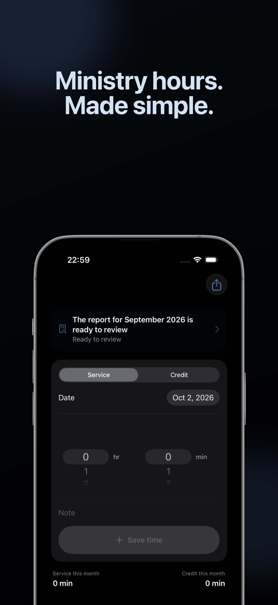
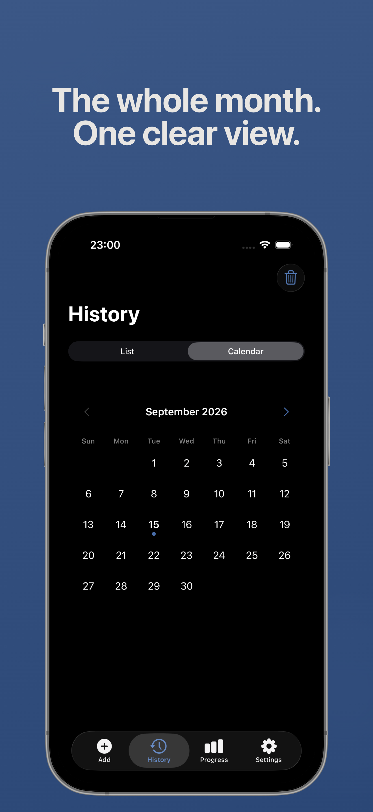
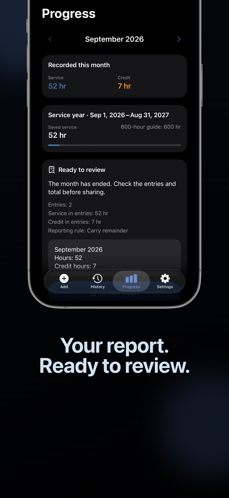

# Hourleaf App Store screenshots

Reproducible marketing deck for `Hourleaf: Ministry Hours`, scaffolded from the
MIT-licensed `app-store-screenshots` skill. The editor is isolated from the
Swift/Xcode targets and is used only to compose and export Store artwork.
The upstream copyright notice is preserved in
`LICENSE.app-store-screenshots`.

## Preview

| Quick entry | Calendar | Monthly report |
|---|---|---|
|  |  |  |

The canonical deck has three iPhone slides in `en-US`, `ru`, and `uk`. It uses
reviewed Release-build captures from `../screenshots/`; it contains no personal
ledger data, account details, or generated app UI. Apple Watch captures remain
in Apple's separate Watch screenshot section.

## Quick start

```bash
bun install   # or pnpm / yarn / npm
bun dev       # http://127.0.0.1:3000
```

Open the editor, inspect each locale, then use **Export bundle** for exact
6.9-inch, 6.5-inch, 6.3-inch, and 6.1-inch PNG bundles. Commit changes to
`app-store-screenshots.json` when copy or layout is adjusted.

The export path redraws every render onto an opaque canvas before encoding the
PNG. This is required because App Store screenshots cannot contain an alpha
channel or transparency.

## Release masters

The reviewed 6.9-inch masters live in `exports/iphone-6.9/{en-US,ru,uk}/`.
Apple scales these highest-resolution iPhone screenshots for smaller display
classes, so the repository does not keep duplicate lower-resolution exports.

Before upload, run:

```bash
bun run verify:exports
```

The guard requires all nine files to be opaque RGB PNGs at exactly 1320×2868.
Every Store slide shows Hourleaf in use; text-only artwork is intentionally not
part of the release deck.

## What's inside

- **Connected canvas editor** (`src/components/editor/`) — every screen sits on one horizontal canvas, so phones, captions, and other elements can be dragged across screen boundaries and exported as split crops when Connected mode is enabled.
- **Screen controls** — drag-to-reorder screens, click-to-edit text, screenshot drop targets, per-screen layout switcher, dark/light toggle.
- **Device frames** (`src/components/editor/device-frames.tsx`) — iPhone (PNG mockup), iPad, Android phone, Android tablet (portrait + landscape), feature graphic.
- **Auto-save (git-trackable)** — every change is persisted within ~600ms to **`app-store-screenshots.json`** at the project root (via `/api/project`) **and** mirrored to `localStorage` as an instant-paint cache. Commit `app-store-screenshots.json` and you can `git clone` to another machine and resume exactly where you left off.
- **Multi-device decks** — iOS and Android slide decks live side by side; switching the platform tab preserves both.
- **One-click export** — bulk PNG export at any required App Store / Play Store resolution using `html-to-image`; each PNG is rendered from the current connected or isolated deck mode.
- **Project migration** — older `app-store-screenshots.json` files are migrated on load. Existing per-slide transforms remain valid, and connected crops become available without rewriting the deck by hand.
- **Legacy-safe mode** — pre-v2 projects opened directly in the editor start in isolated-screen mode first, then can opt into connected crops with the toolbar's Connected/Isolated control. Skill-run in-place migrations keep legacy decks isolated unless the project had already explicitly opted into connected canvas.

## Adding screenshots

Two ways:

1. **Drop a file in the inspector** — drag-and-drop or click Pick. The file is sent to `/api/upload`, hashed, and written to `public/screenshots/uploaded/<hash>.png`. The slide stores the resulting `/screenshots/uploaded/...` path, so commit those files alongside `app-store-screenshots.json` and the screenshots survive a `git clone`.
2. **Reference a static file** — put PNGs under `public/screenshots/{platform}/{device}/{locale}/` and reference them by path. Default sample slides expect:
   - `public/screenshots/apple/iphone/en/...`
   - `public/screenshots/android/phone/en/...`
   - `public/screenshots/apple/ipad/en/...`

Update the matching `screenshot` fields in `app-store-screenshots.json` to point at whatever filenames you choose.

## Exporting

The toolbar dropdown lists every Apple/Google-required size for the current device. Click **Export bundle** to download a zip. In Connected mode, each PNG is clipped from the connected canvas, so an element that straddles two screens appears split exactly where you placed it. In Isolated mode, each screen clips its own elements and legacy offscreen content cannot leak into neighboring exports.

## Customizing

| Where | What |
|-------|------|
| `src/lib/constants.ts` | Canvas dimensions, export sizes, frame ratios, themes, locales |
| `app-store-screenshots.json` | Canonical starter project: app name, current device, connected-canvas mode, slide copy, screenshots, and transforms |
| `src/lib/defaults.ts` | Fallback/reset state used when no project file or local cache exists |
| `src/components/editor/slide-canvas.tsx` | Add new layouts and connected-canvas element rendering |
| `src/components/editor/device-frames.tsx` | Tweak device chrome (bezel radii, camera dots) |
| `src/app/layout.tsx` | Swap the font (`next/font/google`) |

## Notes

- `mockup.png` is the iPhone bezel overlay; replacing it requires re-measuring the `PHONE_SCREEN` constants.
- Image preloading converts every static path to a base64 data URI before exports run, and export retries paths that were previously missing — this prevents the html-to-image race where some slide screenshots come out black.
- Reset via the toolbar's circular arrow icon clears in-memory state and reloads the default screens. To wipe disk state too, delete `app-store-screenshots.json`.
- **Persistence model** — the canonical state lives in `app-store-screenshots.json` (git-tracked). On load, the editor reads localStorage first for instant paint, then overwrites with the file contents if present; if the file endpoint is unavailable, autosave is blocked so stale cache cannot overwrite disk. On save, both are written. If you ever see a conflict, the file always wins.
- **Migration model** — schema v1 projects do not need a manual conversion. On first load, the editor upgrades localized text and transform records, writes `schemaVersion: 2`, preserves all existing screens, and keeps `connectedCanvas: false` so old offscreen/clipped elements export exactly as isolated screens. Turn on **Connected** in the toolbar when you want elements to cross screen edges. Explicit skill migrations preserve an existing `connectedCanvas` choice, otherwise they keep legacy decks isolated too.
- **Custom themes** — if a project file references a theme id that is not present in `src/lib/constants.ts`, the editor falls back to `clean-light` and shows a warning. Merge custom `THEMES` entries during in-place upgrades.
